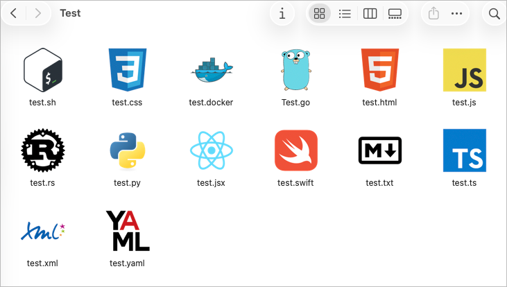

# MacDevIcons
Beautiful developer file-type icons for macOS Finder — powered by https://devicon.dev

# Motivation
On a fresh macOS install, developer file icons don’t just look bad — they don’t exist. Unless you install a heavyweight IDE, macOS happily assigns the same mystery-generic-blank-document icon to everything: JavaScript, TypeScript, JSON, Python, Go, Rust, C++, Markdown et al.

For developers who prefer lightweight editors like Zed, Neovim, Emacs, or anything that isn’t a 2-GB IDE, the result is a Finder window where every file looks identical — a digital version of guessing which identical twin is which. MacDevIcons fixes this.

It gives you clean, dev-friendly icons for your file types without requiring a giant IDE. Just run the app, open files through it, and Finder immediately becomes visually meaningful again.

PS: You are never going to see all these file types together in one folder unless you are testing icons. The dockerfile is currently a hack using the .docker extension.

## How It Works
MacDevIcons, repackages a minimal AppleScript compiled on the user's Mac with osacompile, claims ownership of selected file types through its Info.plist. When you open a file using the MacDevIcons app, macOS associates that extension with the app’s custom icons, making Finder display the correct [DevIcon](https://devicon.dev) artwork. The app then forwards the file path to your chosen editor (config.json). 

A Python build script regenerates icons, updates plist claims, and bundles everything so the app behaves like a lightweight, system-level file-type decorator plus launcher.

## Usage
- Modify /config/config.json
- Run build.sh
- Make 'MacDevIcons' default app to open the file types with

## Supported File Types
- The supported icons are at /vendor/devicon/icons
- Select the icon and modify the config.json @ /config/config.json

## Roadmap
- Not sure but hope to claim UTIs for 'Dockerfile' and show that pretty docker whale without needing the .docker extension. Ditto for Makefiles.

## Acknowledgements
https://github.com/devicons/devicon